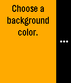

# actionmenu-backgrounds

Example app demonstrating simple use of the ActionMenu API to allow an app user
to choose the background color of the app. The text color is derived from this
color as the most legible choice of black or white.
